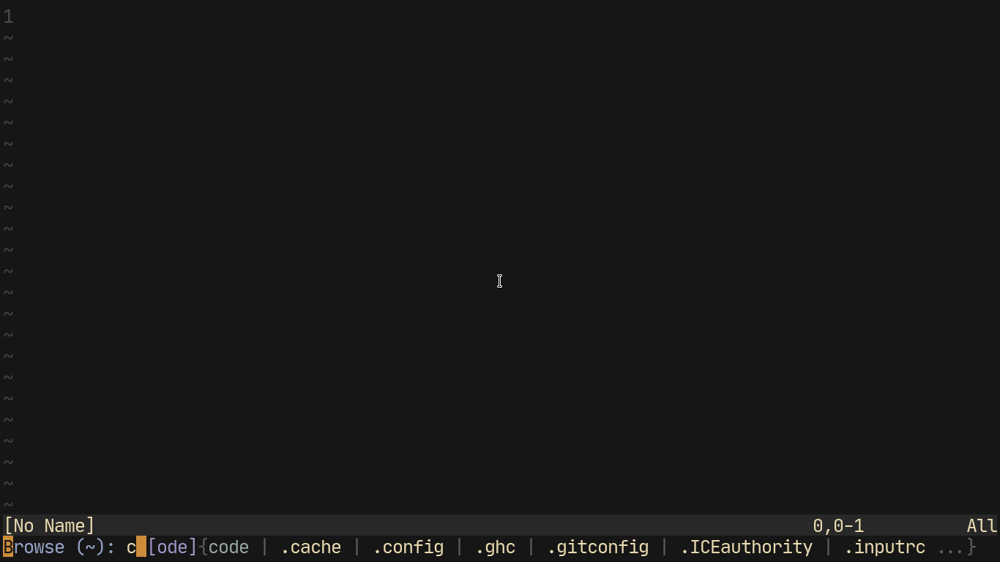

# Ido.nvim


Ido mode in neovim. This is a feature which has its origins in the greatest operating system of all item, Emacs. It is configured in Lua because it is nice and fast.

## Install
Install this like any other neovim plugin. Here are some copy-pasta commands.

### Plugin Managers
```vim
" Vim plug
Plug 'shoumodip/ido.nvim'

" Vundle
Plugin 'shoumodip/ido.nvim'

" Dein
call dein#add('shoumodip/ido.nvim')

" Minpac
call minpac#add('shoumodip/ido.nvim')

" Packer.nvim
use 'shoumodip/ido.nvim',
```

### Manual
```sh
## Pathogen
cd ~/.config/nvim/bundle && git clone https://github.com/shoumodip/ido.nvim

## NeoVim builtin package system
cd ~/.config/nvim/pack/plugins/start && git clone https://github.com/shoumodip/ido.nvim
```

## Important
***NOTE:*** All the documentation shown from now on is in lua. Dont' attempt to do this stuff in VimL.

## How to use
First make sure to require the ido module:

```lua
local ido = require('ido')
```

After which Ido can be invoked using `ido.complete({OPTIONS})` which takes a table as an input. The table `OPTIONS` can contain four items / subtables --

`prompt` The prompt to be used. If left blank, then `ido_default_prompt` will be used.

`items` The list of items to match on.

`keybinds` Custom keybindings to be used. If left default, then `ido_keybindings` will be used.

`on_enter` The function which will be executed on returning the value.

For example.

```lua
print(ido.complete({prompt = 'Choose: ', items = {'red', 'green', 'blue'}}))
```

Or just use the default prompt.
```lua
print(ido.complete({items = {'red', 'green', 'blue'}}))
```

Maybe a custom function.

```lua
ido.complete({items = {'red', 'green', 'blue'}, on_enter = function(s) print(s) end})
```

Particular order does not matter here. The options can be placed in whatsoever way you want. There is no specification on whether prompt should be placed at the first or something like that.

For a more "complex" example, check out `ido_find_files()` in *menus.lua*. (Bound to `<Leader>.`)\
***Note:*** These are lua functions. So when calling these from a VimL file, you need to put the `lua` keyword at the beginning.

Also check out the Api section in the `README` to fully understand the ways of extending Ido mode.

## Colors
Most probably, Ido will look horrible on your terminal. The reason being Ido uses some weird emulation techniques in order to enable *returning* of the selected item. So most probably you will need to change these highlight settings.

`IdoCursor` The virtual cursor emulation used in Ido.

`IdoSelectedMatch` The color for the selected match.

`IdoPrefix` The color used for the prefix.

`IdoSeparator` The color used for the separator, the match start character and the match end character.

`IdoPrompt` The color used for the prompt.

## Settings
Ido is very extensible and enables the user to configure the following global settings:

`fuzzy_matching` (**Boolean**) Whether Ido should match fuzzily or not. Set to `true` by default.

`case_senstive` (**Boolean**) Whether Ido should match case-senstively or not. Set to `false` by default.

`overlap_statusline` (**Boolean**) Whether the Ido floating window should overlap the statusline or not. Set to `false` by default.

`min_lines` (**Number**) The minimum boundary of the Ido minibuffer. Only important if `ido_limit_lines` is `true`.

`max_lines` (**Number**) The maximum boundary of the Ido minibuffer. Only has any effect if `ido_limit_lines` is `false`.

`limit_lines` (**Boolean**) If the number of lines in the Ido minibuffer exceeds `ido_min_lines`, decides whether to show the `more_items` symbol or make the minibuffer `ido_max_lines` tall. `true` by default.

`minimal_mode` (**Boolean**) If set to `true`, Ido will be rendered in command mode (`:`), and the `ido_{min, max, limit}_lines` will have no effect. If set to `false`, Ido will be rendered in a floating window, and the afforementioned variables will have effect if needed. `false` by default.



The various settings of Ido can be set directly using the `ido.settings` table

`lua require('ido').settings[ITEM] = VALUE`

Or by requiring ido in a module/lua file:

```lua
local ido = require('ido')

ido.settings.fuzzy_matching = true
ido.settings.min_lines = 5
```

Or using the `ido.setup` initialization function:

```lua
local ido = require('ido')

ido.setup({
  settings = {
    fuzzy_matching = true,
    min_lines = 5
  }
})
```

## Ido Decorations
Ido utilizes various `symbolifiers` for decorating parts of it's user interface:

`prefixstart` The character shown before the *prefix*. See below for stuff about the *prefix*. By default, it is `[`.

`prefixend` The character shown after the prefix. By default, it is `]`.

`matchstart` The character shown before the available matches. (if any) By default it is empty.

`matchend` The character shown after the matches. By default it is empty.

`separator` The separator between matches. By default it is ` | `.

`marker` The indicator for the current item. By default it is empty.

`moreitems` The character which denotes there are more matches which are not being rendered. Has no effect if `ido_limit_lines` is `false`. By default it is `...`.


The various `symbolifiers` of Ido can be set directly using the `ido.decorations` table

`lua require('ido').decorations[ITEM] = VALUE`

Or by requiring ido in a module/lua file:

```lua
local ido = require('ido')

ido.decorations.separator = '|'
ido.decorations.prefixstart = '['
ido.decorations.prefixend = ']'
```

Or using the `ido.setup` initialization function:

```lua
local ido = require('ido')

ido.setup({
  decorations = {
    separator = '|',
    prefixstart = '['
    prefixend = ']'
  }
})
```

Some examples of Ido decorations --

### Vertical layout

Combine the `limit_lines` setting with several `symbolifiers` to get a vertical layout:

```lua
local ido = require('ido')

ido.decorations = {
  separator = '\n    '
  matchstart  = '\n'
  marker      = ' -> '
  moreitems   = ''
}

ido.settings.limit_lines = false
```

Or using the `ido.setup` initialization function:

```lua
ido.setup({
  settings = {
    limit_lines = false
  },
  decorations = {
    separator = '\n    '
    matchstart  = '\n'
    marker      = ' -> '
    moreitems   = ''
  }
})
```

The resulting interface will look like this:


## Prefix
*prefix* - The most awesome feature in existence. When using Ido, it will provide the least common prefix substring as a *suggestion*. Pressing `<Tab>` will do what you expect - **tab completion**! If there is only one item as a match, the entire match will become the prefix and on pressing `<Tab>`, it will complete the prefix and accept the item like `<Return>`.

    Find files: d[o] {documents | downloads}

Here `[o]` is the prefix being suggested as the substring `do` is present at the beginning of all the available matches.

    >>> mus[music]

Here `[music]` is the only available match. Therefore the entire item is the suggestion.

## Hotkeys
`<C-n>`    The next item\
`<C-p>`    The previous item

`<C-f>`    Forward a character\
`<C-b>`    Backward a character

`<C-a>`    Start of line\
`<C-e>`    End of line

`<Right>`  Forward a character\
`<Left>`   Backward a character

`<Tab>`    Prefix completion\
`<Return>` Accept the selected item, else accept the pattern text\
`<Escape>` Escape Ido, duh

## API
Ido mode was originally from Emacsland. Therefore not provinding an API would be sacriligeous. Since Ido mode is near enough infinitely extensible, therefore this is divided into 3 parts.

### Keybindings
It is divided into two parts -- the global keybindings and the temporary keybindings.

Keybindings consist of `["KEYNAME"] = 'FUNCTION'`

where `KEYNAME` is the key binding in standard vim notation (see `key-notation`).

And `FUNCTION` is a global Lua function, emphasis on global. I could'nt find a way to make it work with local functions, so unless you have a solution and create a pull request, global functions it is. Also the functions must ***not*** have the `'(<args>)'` part. There can be no parenthesis at the end used for calling a function.

#### Global
These are the keybindings used in every single instance of Ido. This is set in the `ido.keybindings` table. For example this is something a psychopath would put in the keybindings.

```lua
local ido = require('ido')

ido.keybindings = {
  ["<Right>"] = 'ido_cursor_move_begin',
  ["<Left>"]  = 'ido_cursor_move_end',
}
```

***Note:*** After changing the global keybindings using the `ido.keybindings` table, you have to execute the `ido.load_keys()` lua function in order to load the keys.

Or you could use the `ido.setup` initialization function (which loads the keys for you automatically):

```lua
local ido = require('ido')

ido.setup({
  keybindings = {
    ["<Right>"] = 'ido_cursor_move_begin',
    ["<Left>"]  = 'ido_cursor_move_end',
  }
})
```


#### Temporary
These are keybindings used in only one instance of Ido, and are defined in the table of options supplied to `ido.complete`.

```lua
print(ido.complete({items = {'red', 'green', 'blue'}, keybinds = {["<Right>"] = 'ido_cursor_move_end'}}))
```

### Variables
Ido utilizes various `variables` to keep track of it's internal state. All of which are exposed to you, the user, in the `ido.vars` table.

`matched_items` The table of the items matched.

`window` The floating window belonging to Ido.

`buffer` The buffer used by Ido.

`before_cursor` The text present before the virtual cursor position in Ido.

`after_cursor` The text present after the virtual cursor position in Ido.

`prefix` The prefix

`prefix_text` The complete prefix, containing the pattern and the prefix.

`current_item` The current selected item in Ido.

`render_text` The text being rendered in Ido.

`default_prompt` The default prompt of Ido. ('>>> ')

`cursor_position` The virtual cursor position of Ido.

`more_items` Whether there are more items which are not being rendered.

`pattern_text` The pattern being matched in the items.

`match_list` The list of items on which the pattern is being matched.

`prompt` The prompt being used.

The various `variables` of Ido can be set directly using the `ido.vars` table

`lua require('ido').vars[ITEM] = VALUE`

Or by requiring ido in a module/lua file:

```lua
local ido = require('ido')

ido.vars.default_prompt = '$ '
```

Or using the `ido.setup` initialization function:

```lua
local ido = require('ido')

ido.setup({
  vars = {
    default_prompt = '$ ',
  }
})
```

### Functions
Ido utilizes various functions across it's lifecycle, all of which are exposed to you, the user, in the `ido.` module.
The functions defined in Ido are:

`close_window` Close the Ido window and stop the character input loop.

`get_matches` Get the items which match with the pattern. Also find out the prefix.

`insert_char` Insert the character you last pressed. Does |not| take any argument.

`key_backspace` Emulate the backspace key in Ido.

`key_delete` Emulate the delete key in Ido.

`cursor_move_left` Move the virtual cursor left a character.

`cursor_move_right` Move the virtual cursor right a character.

`cursor_move_begin` Move the virtual cursor to the beginning of the pattern.

`cursor_move_end` Move the virtual cursor to the endning of the pattern.

`next_item` Select the next match.

`prev_item` Select the previous match.

`complete_prefix` Complete the prefix.

### Special Functions
There are two categories of functions that need special attention when working with them:

#### Extensible funtions

The `get_matches` functions uses three functions to filter/sort/generate prefix.
Each of which can be overwritten / extended to change the global behavior of Ido.

These functions are all exposed on the `ido` module:

`filter(pattern_text, match_list)` The function that *filters* the items and returns the items that match the `pattern_text`

`sorter(left, right)` The function that *sorts* the items. Behaves like any regular `table.sort` callback.

`suggester(pattern_text, matched_items)` generates prefix based on the *sorted* `matched_items`, and `pattern_text`

For instance in order to overwrite the sorting function to sort in reverse order:

```lua
local ido = require('ido')

ido.sorter = function(a,b)
  ido.fzy.score(a) > ido.fzy.score(b)
end
```

#### Internal functions
The functions which aren't really functions but are recognised by Ido by an `if-else` statement. Meant to be used **only** in keybindings. I repeat, *"Do not try to use this in your function or whatever!"*

`ido_accept` Accept the current item.

`ido_complete_prefix` Complete the prefix. If there is only one matching item, then behaves the same as `ido_accept`.

## Help in Neovim
`:h ido.txt` Main help file.

## License
MIT
