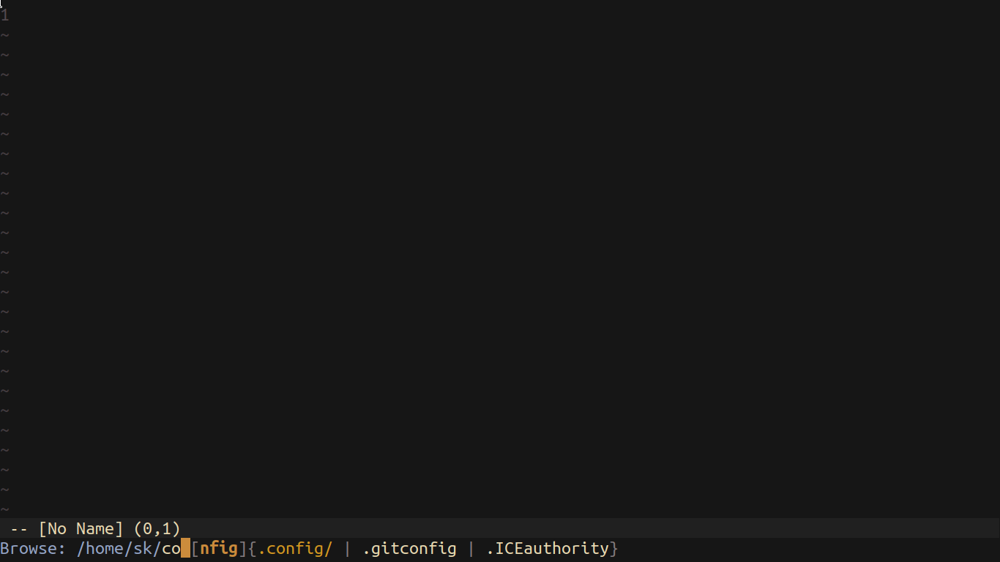
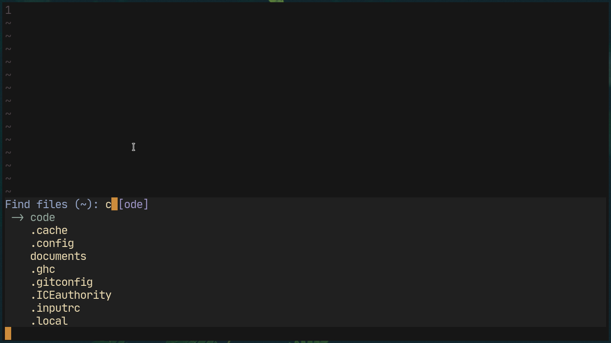

# Ido Neovim
For those of you who have been in touch with Emacsland, know of a certain feature called *Ido*. It is essentially a narrowing framework for Emacs. Well guess what, due to recent API changes in Neovim nightly, it need not be confined to Emacs any more!



# Installation
Using Neovim's builtin package system.
```sh
git clone https://github.com/shoumodip/ido.nvim ~/.config/nvim/pack/plugins/start/ido.nvim
```

You can also use any package manager of your choice.

# How to use
Ido is invoked using `ido_completing_read(PROMPT, {ITEMS})` where

`PROMPT` The prompt used. To use the default prompt (`>>>`), set it to `nil`. To use an empty prompt, use `""`. To use a different prompt, set it to a different prompt.\
`ITEMS`  The table of items to be matched against.

For example --

```lua
print(ido_completing_read('Select: ', {'red', 'green', 'yellow', 'blue', 'magenta'}))
```

Or --

```lua
print(ido_completing_read('Find files: ', vim.fn.systemlist('ls -A ~')))
```

For a more "complex" example, check out `ido_find_files()` in *menus.lua*. (Bound to `<Leader>.`)
***Note:*** These are lua functions. So when calling these from a VimL file, you need to put the `lua` keyword at the beginning.

# Colors
Most probably, Ido will look horrible on your terminal. The reason being Ido uses some weird emulation techniques in order to enable *returning* of the selected item. So most probably you will need to change these highlight settings.

`IdoCursor` The virtual cursor emulation used in Ido.

`IdoStatus` The status highlight of Ido. Ideally the foreground of this should be set to the terminal background color and the background of this should be set the terminal cursor color.

`IdoSelectedMatch` The color for the selected match.

`IdoPrefix` The color used for the prefix.

`IdoSeparator` The color used for the separator, the match start character and the match end character.

`IdoPrompt` The color used for the prompt.

# Settings
Just like the Ido mode of Emacs, the Ido mode of Neovim is perfectly extensible. The settings are lua variables, so its a simple
```vim
lua VARNAME = VALUE
```

`ido_fuzzy_matching` (**Boolean**) Whether Ido should match fuzzily or not. Set to `true` by default.

`ido_case_senstive` (**Boolean**) Whether Ido should match case-senstively or not. Set to `false` by default.

`ido_min_lines` (**Number**) The minimum boundary of the Ido minibuffer. Only important if `ido_limit_lines` is `true`.

`ido_max_lines` (**Number**) The maximum boundary of the Ido minibuffer. Only has any effect if `ido_limit_lines` is `false`.

`ido_limit_lines` (**Boolean**) If the number of lines in the Ido minibuffer exceeds `ido_min_lines`, decides whether to show the `more_items` symbol or make the minibuffer `ido_max_lines` tall. `true` by default.

# Ido Decorations
The various symbolifiers of Ido, like match separator, prefix start, etc. This is a lua dictionary so `lua ido_decorations[ITEM] = VALUE`, where `ITEM` is one of the following --

`prefixstart` The character shown before the *prefix*. See below for stuff about the *prefix*. By default, it is `[`.

`prefixend` The character shown after the prefix. By default, it is `]`.

`matchstart` The character shown before the available matches. (if any) By default it is empty.

`matchend` The character shown after the matches. By default it is empty.

`separator` The separator between matches. By default it is ` | `.

`marker` The indicator for the current item. By default it is empty.

`moreitems` The character which denotes there are more matches which are not being rendered. Has no effect if `ido_limit_lines` is `false`. By default it is `...`.

Some examples of Ido decorations --

## Vertical layout
Execute these as lua commands.

```lua
ido_decorations['separator']   = '\n    '
ido_decorations['matchstart']  = '\n'
ido_decorations['marker']      = ' -> '
ido_decorations['moreitems']   = ''
ido_limit_lines                = false
```

This will create a vertical layout for Ido --



# Prefix
*prefix* - The most awesome feature in existence. When using Ido, it will provide the least common prefix substring as a *suggestion*. Pressing `<Tab>` will do what you expect - **tab completion**! If there is only item as a match, the entire match will become the prefix and on pressing `<Tab>`, it will complete the prefix and accept the item like `<Return>`.

    Find files: d[o] {documents | downloads}

Here `[o]` is the prefix being suggested as the substring `do` is present at the beginning of the all the available matches.

    >>> mus[music]

Here `[music]` is the only available match. Therefore the entire item is the suggestion.

# Hotkeys
`<C-n>`    The next item\
`<C-p>`    The previous item

`<C-f>`    Forward a character\
`<C-b>`    Backward a character

`<Right>`  Forward a character\
`<Left>`   Backward a character

`<Tab>`    Prefix completion\
`<Return>` Accept the selected item, else accept the pattern text\
`<Escape>` Escape Ido, duh

# License
MIT
