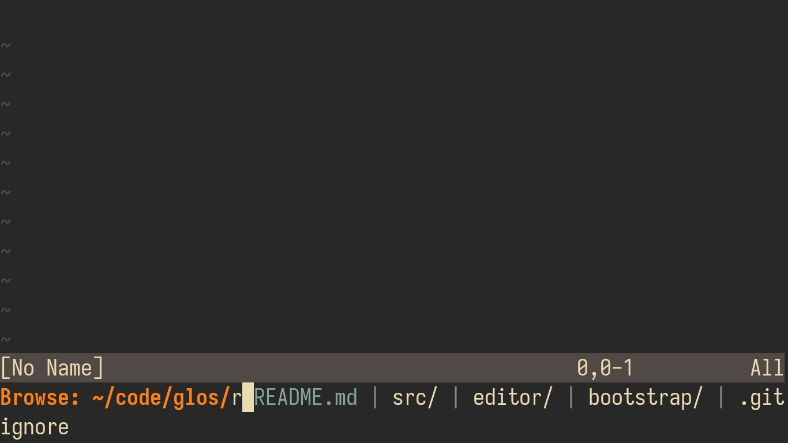

# ido.nvim
An Emacs inspired narrowing system for Neovim



## Install
Use your plugin manager of choice to install this plugin

| Plugin manager                                    | Command                                |
| ------------------------------------------------- | -------------------------------------- |
| [Vim Plug](https://github.com/junegunn/vim-plug)  | `Plug 'ido-nvim/ido.nvim'`             |
| [Vundle](https://github.com/VundleVim/Vundle.vim) | `Plugin 'shoumodip/ido.nvim'`          |
| [Dein](https://github.com/Shougo/dein.vim)        | `call dein#add('ido-nvim/ido.nvim')`   |
| [Minpac](https://github.com/k-takata/minpac)      | `call minpac#add('ido-nvim/ido.nvim')` |

Or use the builtin packages feature

```console
$ cd ~/.config/nvim/pack/plugins/start
$ git clone https://github.com/ido-nvim/ido.nvim
$ git submodule update --init --recursive
```

## Usage
```vim
:lua require("ido").start({"red", "green", "blue"})
```

## Quick Start
| Command               | Description                                                                           |
| --------------------- | ------------------------------------------------------------------------------------- |
| `:Ido std.browse`     | Browse the filesystem                                                                 |
| `:Ido std.buffer`     | Switch buffers                                                                        |
| `:Ido std.find_files` | Find files recursively under the current directory                                    |
| `:Ido std.git_files`  | Find files in a git repository                                                        |
| `:Ido std.git_diff`   | Find files with changes                                                               |
| `:Ido std.git_log`    | Open log for a commit, requires [vim-fugitive](https://github.com/tpope/vim-fugitive) |
| `:Ido std.git_status` | Find files with git changes                                                           |

Ido uses standard [Readline Keybindings](https://spin.atomicobject.com/2017/11/10/readline-productivity/) by default.

## Documentation
TBD
