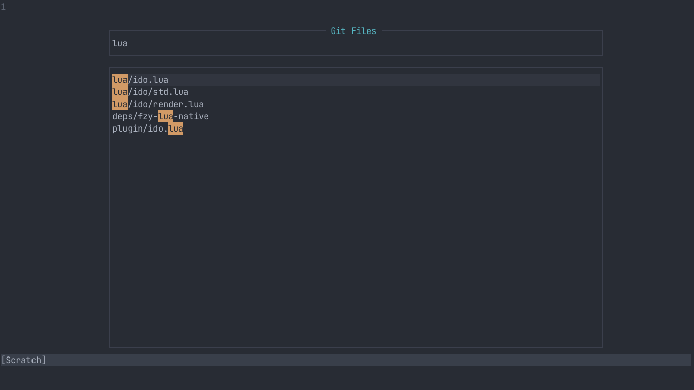

# ido.nvim
An Emacs inspired narrowing system for Neovim



## Install
```vim
Plug 'shoumodip/ido.nvim'
```

## Basic Usage

* `ido.start(items, callback, title)`

```lua
require("ido").start({"red", "green", "blue"}, function (v)
  print(v)
end)
```

| Key                  | Description          |
| -------------------- | -------------------- |
| <kbd>\<esc\></kbd>   | Quit                 |
| <kbd>\<c-c\></kbd>   | Quit                 |
| <kbd>\<c-j\></kbd>   | Accept the query     |
| <kbd>\<cr\></kbd>    | Accept the selection |
| <kbd>\<tab\></kbd>   | Select next item     |
| <kbd>\<s-tab\></kbd> | Select previous item |

## Browse
Navigate the filesystem

```lua
require("ido").browse()
```

| Key                  | Description          |
| -------------------- | -------------------- |
| <kbd>\<a-l\></kbd>   | Enter directory      |
| <kbd>\<a-h\></kbd>   | Parent directory     |

## Buffers
Switch between buffers

```lua
require("ido").buffers()
```

## Git Files
Open git files, default to Browser outside git repos

```lua
require("ido").git_files()
```

## Git Grep
Search patterns in git repos

```lua
require("ido").git_grep()
```

## Man Pages
Open man pages

```lua
require("ido").man_pages()
```

## Helptags
Open vim helptags

```lua
require("ido").helptags()
```

## Global Keybindings
Will bind for all Ido runs

```lua
local ido = require("ido")

ido.bind {
  ["jk"] = ido.exit,
  ["<c-j>"] = ido.next,
  ["<c-k>"] = ido.prev,
  ["<tab>"] = ido.accept_item,
}
```

## Instance Keybindings
Will bind for the current run only

```lua
local ido = require("ido")

ido.git_files()
ido.bind {
  ["<a-i>"] = function ()
    vim.fn.mkdir(ido.get_query())
  end
}
```

## Custom Window Title
```lua
require("ido").start({"red", "green", "blue"}, print, "Select Colors")
```
