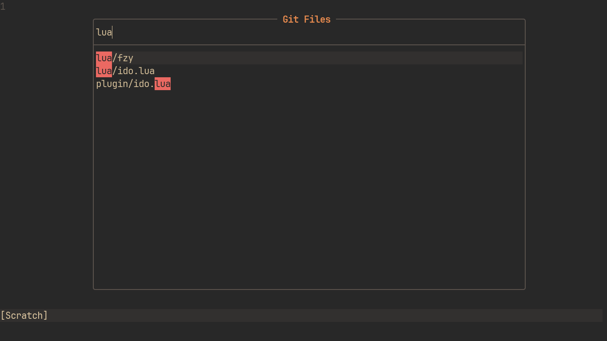

# ido.nvim
Simple fuzzy searcher for Neovim



## Install
```vim
Plug 'shoumodip/ido.nvim'
```

## Basic Usage

* `ido.start(items, callback, title)`

```lua
require("ido").start({"red", "green", "blue"}, function (v)
  print(v)
end)
```

| Key                  | Description          |
| -------------------- | -------------------- |
| <kbd>\<esc\></kbd>   | Quit                 |
| <kbd>\<c-c\></kbd>   | Quit                 |
| <kbd>\<c-j\></kbd>   | Accept the query     |
| <kbd>\<cr\></kbd>    | Accept the selection |
| <kbd>\<tab\></kbd>   | Select next item     |
| <kbd>\<s-tab\></kbd> | Select previous item |

## Execute
Execute registered ido functions, which are listed below

```lua
require("lua").execute()
```

## Browse
Navigate the filesystem

```lua
require("ido").browse()
```

| Key                  | Description                        |
| -------------------- | ---------------------------------- |
| <kbd>\<a-l\></kbd>   | Enter directory                    |
| <kbd>\<a-h\></kbd>   | Parent directory                   |
| <kbd>\<a-o\></kbd>   | Change directory to current active |

## Buffers
Switch between buffers

```lua
require("ido").buffers()
```

## Lines
Search the lines of the current buffer

```lua
require("ido").lines()
```

| Key                  | Description                       |
| -------------------- | --------------------------------- |
| <kbd>\<a-o\></kbd>   | Save matches to the quickfix list |

## Colorschemes
Switch between colorschemes

```lua
require("ido").colorschemes()
```

## Git Files
Open git files, default to Browser outside git repos

```lua
require("ido").git_files()
```

## Git Grep
Search patterns in git repos

```lua
require("ido").git_grep()
```

| Key                  | Description                       |
| -------------------- | --------------------------------- |
| <kbd>\<a-o\></kbd>   | Save matches to the quickfix list |

## Projects
Switch to a project within a directory

```lua
require("ido").projects("~/Git") -- Projects base path of choice

-- OR --

require("ido").projects()        -- Select projects base path via input prompt
```

## Man Pages
Open man pages

```lua
require("ido").man_pages()
```

## Helptags
Open vim helptags

```lua
require("ido").helptags()
```

## Global Keybindings
Will bind for all Ido runs

```lua
local ido = require("ido")

ido.bind {
  ["jk"] = ido.exit,
  ["<c-j>"] = ido.next,
  ["<c-k>"] = ido.prev,
  ["<tab>"] = ido.accept_item,
}
```

## Instance Keybindings
Will bind for the current run only

```lua
local ido = require("ido")

ido.git_files()
ido.bind {
  ["<a-i>"] = function ()
    vim.fn.mkdir(ido.get_query())
  end
}
```

## Custom Window Title
```lua
require("ido").start({"red", "green", "blue"}, print, "Select Colors")
```

## Custom Registered Function
Registered functions show up in the `ido.execute` selector as well as in the
`ido` namespace

```lua
local ido = require("ido")

ido.register("lines_that_match", function ()
  local query = vim.fn.input("Query: ")
  if query == "" then
    return
  end

  local lines = vim.api.nvim_buf_get_lines(0, 0, -1, false)
  local max = #tostring(#lines)

  for i in ipairs(lines) do
    lines[i] = string.rep(" ", max - #tostring(i))..i..": "..lines[i]
  end

  lines = vim.tbl_filter(
    function (line)
      return string.find(line, query, max + 2, true)
    end,
    lines
  )

  ido.start(lines, function (line)
    local index = line:find(":")
    if index then
      vim.api.nvim_win_set_cursor(0, {tonumber(line:sub(1, index - 1)), 0})
    end
  end, "Lines That Match")
end)
```

This function can now be called with both the following ways

```lua
require("ido").lines_that_match()
```

OR

```lua
require("ido").execute()
```
